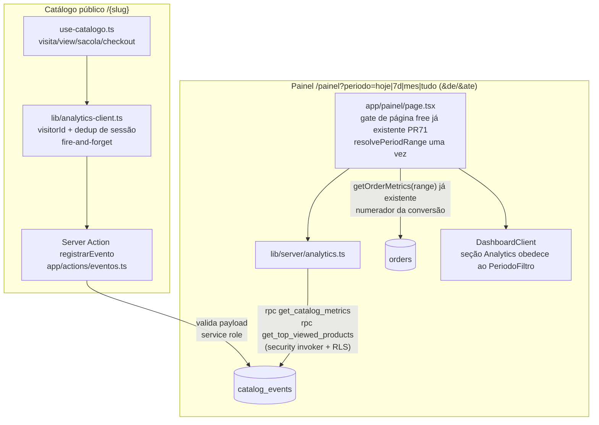

# Analytics Nativo — Design

**Spec**: `.specs/features/analytics-nativo/spec.md`
**Status**: Approved (2026-07-30; revisado no mesmo dia após merge dos PRs #70/#71 — filtro de período e gate de página no dashboard)

---

## Architecture Overview

Espelho da arquitetura de captura de pedidos (AD-007/AD-008): o catálogo público dispara uma Server Action pública que grava via service role; o painel lê com o client autenticado sob RLS own-store.



### Abordagens consideradas (registro da escolha)

| Abordagem | Trade-off | Veredito |
| --- | --- | --- |
| **A. Tabela de eventos + 2 funções SQL de leitura (RPC, security invoker)** | `count(distinct visitor_id)` do período sai correto e em 1 round-trip; SQL testável; RLS continua valendo dentro da função | **Escolhida** |
| B. Tabela de eventos + view diária `store_metrics_daily` (esboço da conversa) | Somar "únicos por dia" **superconta** visitantes únicos do período (mesmo visitante em N dias conta N vezes); PostgREST não faz `count(distinct)` sem aggregates habilitados | Descartada — erra ANL-12 |
| C. Buscar eventos brutos e agregar em TS no server component | Sem SQL novo, mas payload cresce sem teto com o volume e reimplementa agregação que o Postgres faz melhor | Descartada |
| D. Contadores incrementais (upsert `store_id+day+type`) | Menos linhas, mas perde visitantes únicos e funil por visitante; migração futura dolorosa | Descartada |

A view diária materializada continua sendo o upgrade futuro (rollup + poda, Out of Scope) — as funções RPC recebem `p_from` e servem o e-mail semanal sem retrabalho.

---

## Code Reuse Analysis

### Existing Components to Leverage

| Component | Location | How to Use |
| --- | --- | --- |
| Padrão de Server Action pública | `app/actions/pedidos.ts` (`registrarPedido`) | Mesmo esqueleto: zod → loja por slug ativa → validação de posse → insert via admin; nunca lança, `console.error` no servidor |
| Client admin service-role | `lib/supabase/admin.ts` | Import direto (já `server-only`) |
| Schema zod de payload | `lib/validation/pedido.ts` | Mesmo estilo para `lib/validation/evento.ts` |
| Leitura server-side com `fail()` | `lib/server/pedidos.ts:43` | Mesmo padrão em `lib/server/analytics.ts` — erro de banco nunca vira zero silencioso |
| Métrica pura testável | `lib/order-metrics.ts` (`computeOrderMetrics`) | Mesmo padrão: `lib/catalog-metrics.ts` puro, sem I/O |
| Gate antes do I/O | `app/painel/page.tsx` (early-return free do PR #71 + padrão ORD-29) | Analytics só é buscado depois do early-return — free nunca dispara query |
| Gate de página do dashboard (PR #71) | `app/painel/page.tsx:21` | Early-return para `free` antes de qualquer I/O — é o único gate de exibição; nenhuma capability nova |
| Filtro de período (PR #70) | `components/painel/PeriodoFiltro.tsx`, `lib/period-filter.ts` (`resolvePeriodRange`, `PeriodRange`) | Fonte única do período: a page resolve o range uma vez e alimenta pedidos E analytics |
| Cards de métrica | `components/ui/StatCard.tsx` | Reuso direto para visitas/únicos/cliques/conversão |
| Guard de grants no CI | `.github/workflows/supabase-migrations-check.yml:119` | Estender o passo existente com `catalog_events` + ACL das funções |
| Lista de produtos já carregada | `app/painel/page.tsx:19-27` | Resolve nome/imagem dos "mais vistos" no client — sem join no servidor; produto deletado sai naturalmente (assumption da spec) |

### Integration Points

| System | Integration Method |
| --- | --- |
| `orders` | Numerador da conversão: `OrderMetrics.ordersThisMonth` do `getOrderMetrics(storeId, range)` **já chamado pela page** com o mesmo range (periodizado, exclui `cancelado` — AD-010). Zero query nova |
| `products` | Validação de posse do `product_id` na Server Action (admin client); nomes dos mais vistos via props já existentes do dashboard |
| `stores` | Resolução `slug → id` + `is_active` na Server Action (mesma query de `registrarPedido`) |

---

## Components

### Migration `catalog_events`

- **Purpose**: Tabela de eventos brutos + índices + RLS + grants.
- **Location**: `supabase/migrations/<ts>_catalog_events.sql`
- **Interfaces**: DDL abaixo (Data Models). RLS: uma policy `select to authenticated` own-store (padrão de `orders`); `revoke all from anon, authenticated` + `grant select to authenticated` + `grant select, insert to service_role` (ANL-10/11 — a lição do default ACL `Dxtm`).
- **Dependencies**: `stores`, `products`.
- **Reuses**: estrutura de `20260727000000_orders.sql` + `20260728000000_orders_service_role_grants.sql`, numa migration só.

### Migration funções de leitura

- **Purpose**: Agregação correta no banco (único lugar que faz `count(distinct)` do período).
- **Location**: `supabase/migrations/<ts>_catalog_metrics_functions.sql`
- **Interfaces** (`p_from`/`p_to` **anuláveis** — o filtro do PR #70 tem "hoje" [from+to], ranges customizados e "tudo" [sem filtro]; predicado `(p_from is null or occurred_at >= p_from) and (p_to is null or occurred_at <= p_to)`):
  - `get_catalog_metrics(p_store_id uuid, p_from timestamptz, p_to timestamptz) returns table(visits bigint, unique_visitors bigint, buy_clicks bigint, bag_visitors bigint)` — `bag_visitors` = `count(distinct visitor_id) filter (where event_type = 'add_to_bag')` (denominador da conversão).
  - `get_top_viewed_products(p_store_id uuid, p_from timestamptz, p_to timestamptz, p_limit int default 5) returns table(product_id uuid, views bigint)` — só `product_view`, `product_id is not null`, ordena por contagem desc.
- **Dependencies**: `catalog_events`.
- **Segurança**: `language sql stable` **security invoker** — RLS da tabela vale dentro da função, então o lojista só agrega a própria loja mesmo passando `p_store_id` alheio (retorna zeros). **`revoke execute ... from public, anon`** + `grant execute to authenticated, service_role` — função nova herda EXECUTE para PUBLIC por default, o análogo funcional do problema de grants desta base.

### `lib/validation/evento.ts`

- **Purpose**: Schema zod do payload público (ANL-08).
- **Interfaces**: `eventPayloadSchema = { slug: string, visitorId: uuid, eventType: enum('catalog_visit','product_view','add_to_bag','buy_click'), productId: uuid | null }`. Regra cruzada: `product_view`/`add_to_bag` exigem `productId`; `catalog_visit`/`buy_click` exigem `productId` nulo.
- **Reuses**: estilo de `lib/validation/pedido.ts`.

### Server Action `registrarEvento`

- **Purpose**: Único caminho de escrita em `catalog_events` (ANL-07..10).
- **Location**: `app/actions/eventos.ts`
- **Interfaces**: `registrarEvento(payload: unknown): Promise<{ ok: boolean }>` — nunca lança.
- **Fluxo**: zod → loja por `slug` com `is_active = true` → se `productId`, confere `products.id + store_id` (sem exigir `is_active`: view de produto recém-desativado é view real) → `insert` — sem consulta de plano (ANL-09), sem rate-limit (Out of Scope; quando o gatilho disparar, copiar o padrão de contagem de `registrarPedido:63-77`).
- **Reuses**: esqueleto completo de `registrarPedido`.

### `lib/analytics-client.ts`

- **Purpose**: Identidade anônima + dedup de sessão + disparo fire-and-forget (client-safe).
- **Interfaces**:
  - `getVisitorId(): string` — `localStorage["cd_visitor_id"]`; sem storage → UUID efêmero em variável de módulo (edge case da spec). **Consentimento (ANL-21):** lê `localStorage["cookie-consent"]` (mesma chave de `components/analytics/use-cookie-consent.ts`, que o layout raiz renderiza também no catálogo); `"rejected"` → não persiste, usa o UUID efêmero. `null`/`"accepted"` → persiste.
  - `shouldTrackVisit(slug): boolean` — `sessionStorage["cd_visited_" + slug]`; marca e retorna true na primeira vez; sem storage → flag em memória.
  - `trackEvent(slug, eventType, productId?): void` — monta payload e `void registrarEvento(...).catch(() => {})`. **Nunca retorna Promise** — impossibilita `await` acidental no caminho crítico.
- **Dependencies**: `registrarEvento`.

### Instrumentação em `app/[slug]/use-catalogo.ts`

- **Purpose**: Ligar os 4 pontos de disparo (ANL-01..05) sem tocar o contrato dos componentes (AD-006).
- **Pontos**:
  - `catalog_visit`: `useEffect` de montagem com `shouldTrackVisit(store.slug)`.
  - `product_view`: novo callback `handleOpenProduct(product)` que faz `setOpenProduct` + track — `CatalogoClient` troca `setOpenProduct` direto por ele.
  - `add_to_bag`: dentro de `handleAdd`, com `product.id`.
  - `buy_click`: em `handleCheckout`, imediatamente após o guard de WhatsApp — **antes** do `window.open` e fora do `Promise.race` (ANL-07; dispara mesmo se `registrarPedido` falhar, edge case da spec).

### Leitura: `lib/server/analytics.ts` + `lib/catalog-metrics.ts`

- **Purpose**: Buscar métricas (server-only) e computar o view-model (puro).
- **Interfaces**:
  - `getCatalogAnalytics(storeId, range: PeriodRange | null): Promise<CatalogAnalytics>` — mesma interface de período de `getOrderMetrics`; `Promise.all` das duas RPCs com `p_from`/`p_to` do range (`null` → `"tudo"`). **Sem query de `orders`**: o numerador da conversão vem do `getOrderMetrics` que a page já chama com o mesmo range. Erro → `fail()` (convenção `lib/server/pedidos.ts:43`).
  - `computeConversionPct(ordersInPeriod, bagVisitors): number | null` (puro, em `lib/catalog-metrics.ts`): conversão = `ordersInPeriod / bagVisitors` em %, `null` quando `bagVisitors = 0` (UI exibe "—"), sem cap.
- **Período**: definido pelo `PeriodoFiltro` existente — a page resolve `resolvePeriodRange(params)` **uma vez** e alimenta `getOrderMetrics` e `getCatalogAnalytics` com o mesmo objeto (ANL-14/15). Nenhum cálculo de janela próprio.

### Dashboard: `page.tsx` + `DashboardClient` + `use-dashboard`

- **Purpose**: Seção "Sua vitrine em números" obedecendo ao filtro existente (ANL-12..16, ANL-22) e gate herdado (ANL-18/19).
- **Período**: nenhum seletor novo. A page já recebe `periodo`/`de`/`ate`; o range resolvido alimenta pedidos e analytics. **Mover o `PeriodoFiltro` do header de "Vendas pela vitrine" para uma posição acima das duas seções** (ele governa ambas agora) — única mudança visual fora da seção nova.
- **Gate**: o early-return de `free` em `page.tsx:21` (PR #71) já cobre tudo — analytics entra **depois** dele, então free não executa query nenhuma (ANL-18). Sem `RecursoBloqueado` novo, sem capability nova.
- **Erro de fetch de analytics**: try/catch na page → `analytics` indisponível → seção com "—" e nota (dashboard não cai; pedidos seguem normais).
- **Top 5**: `use-dashboard` cruza `TopViewedProduct[]` com `products` das props → nome/imagem; ids sem produto (deletado) são filtrados (assumption da spec).

### CI guard

- **Purpose**: ANL-11 — regressão de grants nunca chega verde na main.
- **Location**: passo `Check table privileges` de `.github/workflows/supabase-migrations-check.yml`
- **Checks novos**: `has_table_privilege('service_role','public.catalog_events','insert'|'select')` = true; `anon` com **zero** privilégios de tabela e de coluna em `catalog_events` (mesma consulta de `information_schema.column_privileges` usada para `orders`); `has_function_privilege('anon', 'get_catalog_metrics(uuid,timestamptz,timestamptz)', 'execute')` = false (idem `get_top_viewed_products(uuid,timestamptz,timestamptz,integer)`).

---

## Data Models

### DDL — `catalog_events`

```sql
create table public.catalog_events (
  id          uuid primary key default gen_random_uuid(),
  store_id    uuid not null references public.stores(id) on delete cascade,
  event_type  text not null check (event_type in
                ('catalog_visit', 'product_view', 'add_to_bag', 'buy_click')),
  product_id  uuid references public.products(id) on delete set null,
  visitor_id  uuid not null,
  occurred_at timestamptz not null default now()
);

create index catalog_events_store_time_idx
  on public.catalog_events (store_id, occurred_at desc);
create index catalog_events_store_type_time_idx
  on public.catalog_events (store_id, event_type, occurred_at desc);
create index catalog_events_product_idx
  on public.catalog_events (store_id, product_id)
  where product_id is not null;
```

Sem `client_event_id`/dedup de servidor (assumption aprovada); sem IP/user-agent (ANL-06).

### TypeScript

```typescript
// lib/catalog-metrics.ts
export interface CatalogEventMetrics {
  visits: number;
  uniqueVisitors: number;
  buyClicks: number;
  bagVisitors: number;      // distinct visitors com add_to_bag no período
}

export interface TopViewedProduct {
  productId: string;
  views: number;
}

/** null quando bagVisitors === 0 → UI exibe "—" (ANL-16); sem cap (>100% permitido). */
export function computeConversionPct(
  ordersInPeriod: number,
  bagVisitors: number
): number | null;

// lib/server/analytics.ts
export interface CatalogAnalytics {
  metrics: CatalogEventMetrics;
  topProducts: TopViewedProduct[];
}
```

`DashboardClientProps` ganha `analytics: CatalogAnalytics | null` (`null` = indisponível por erro de fetch; free nunca chega ao componente — gate de página). O período segue vindo de `periodo`/`de`/`ate`, props que a page já passa hoje; a conversão é computada no `use-dashboard` com `metrics.ordersThisMonth` (pedidos do mesmo range) + `analytics.metrics.bagVisitors`.

---

## Error Handling Strategy

| Error Scenario | Handling | User Impact |
| --- | --- | --- |
| Falha/latência ao registrar evento | Fire-and-forget: `void ...catch(() => {})`; erro só em `console.error` do servidor | Nenhum — navegação e checkout seguem (ANL-07) |
| Payload inválido na Server Action | `{ ok: false }` + log; nada gravado (ANL-08) | Nenhum |
| Supabase fora no registro | Evento perdido em silêncio (assumption aprovada) | Nenhum |
| Erro de banco na leitura de métricas | `lib/server/analytics.ts` **lança** (`fail()`, convenção anti-"vazio disfarçado"); `page.tsx` faz try/catch, loga e passa `analytics` com valores indisponíveis | Seção renderiza com "—" e nota "não foi possível carregar agora" — dashboard não cai (edge case da spec); zero real ≠ erro |
| Período sem eventos | Query bem-sucedida devolve zeros | Cards com 0; conversão "—" (ANL-16) |
| `bagVisitors = 0` | `conversionPct = null` | Card de conversão "—" |

---

## Risks & Concerns

| Concern | Location | Impact | Mitigation |
| --- | --- | --- | --- |
| Default ACL do schema não dá DML a ninguém; suíte mocka Supabase e fica verde sem grant | `supabase/migrations/*` (lição de `orders`, AGENTS.md) | Captura falha silenciosa em produção | Grants explícitos na própria migration da tabela + extensão do passo de CI + verificação real `has_table_privilege` como critério de task |
| Função SQL nova herda `EXECUTE` para PUBLIC por default | migration de funções | `anon` poderia invocar RPC de métricas | `revoke execute from public, anon` na migration + check de `has_function_privilege` no CI |
| `handleCheckout` tem caminho crítico delicado (`window.open` síncrono + `Promise.race`) | `app/[slug]/use-catalogo.ts:131-183` | Um `await` de tracking mal posicionado quebra ORD-01/ORD-03 | `trackEvent` retorna `void` (não Promise); disparo antes do `window.open`; teste assertando que o WhatsApp abre com tracking rejeitando |
| `security invoker` + policy só de `authenticated`: RPC com `p_store_id` alheio | migration de funções | Vazamento entre lojas se virasse `security definer` | Manter invoker (RLS filtra → zeros para loja alheia) + teste SQL/manual desse cenário na validação |
| `use-catalogo.ts` (233 linhas) e `DashboardClient` (195) crescem | arquivos citados | Legibilidade | Lógica nova vive em `lib/analytics-client.ts` / `lib/catalog-metrics.ts` (puros, testáveis); hooks só ligam os pontos |
| Banner de consentimento do GA aparece no catálogo (layout raiz) e o `visitor_id` persistente é funcionalmente um cookie | `app/layout.tsx:102`, `components/analytics/use-cookie-consent.ts` | Inconsistência: visitante recusa cookies e ainda assim ganharia identificador persistente | Regra ANL-21: `"rejected"` → id efêmero, eventos continuam; dedup de sessão (`sessionStorage`) mantido por ser funcional e não rastrear entre sessões |
| `NEXT_PUBLIC_SITE_URL` etc. fora do escopo — nenhuma env var nova | — | — | Nada a configurar na Vercel para esta feature |

---

## Tech Decisions (only non-obvious ones)

| Decision | Choice | Rationale |
| --- | --- | --- |
| Agregação de leitura | Funções SQL (RPC) security invoker, não view diária | `count(distinct)` do período correto; RLS preservada; 1 round-trip |
| Denominador da conversão | `count(distinct visitor_id)` com `add_to_bag` | Definição da spec ("sacola → pedido") |
| Numerador da conversão | `OrderMetrics.ordersThisMonth` do `getOrderMetrics(range)` já chamado pela page | Mesmo range, já exclui `cancelado` (AD-010); zero query nova |
| Período | `PeriodoFiltro`/`resolvePeriodRange` existentes (PR #70), default "mês"; `p_from`/`p_to` anuláveis nas RPCs | Um filtro governa o dashboard; supersede as decisões anteriores "janela rolante" e "seletor 7/30" |
| Gate de exibição | Early-return de página do PR #71; **sem** capability `hasAnalytics` | Dashboard inteiro é pago; gate por seção viraria código morto |
| Nome dos "mais vistos" | Cruzamento client-side com `products` já nas props | Evita join/roundtrip; produto deletado sai naturalmente |
| Validação de posse do produto | Confere `store_id`, não exige `is_active` | View de produto recém-desativado é interação real |
| `visitor_id not null` | Client sempre fornece (efêmero se sem storage) | Simplifica agregação; "únicos" degrada graciosamente |

> **Project-level (a registrar em STATE.md na aprovação do design):**
> - **AD-012** — Telemetria de catálogo segue o padrão da captura de pedidos: escrita exclusiva via service role em Server Action pública validada, zero PII (visitor_id anônimo), fire-and-forget que nunca bloqueia navegação/venda; `anon` sem privilégio algum nas tabelas de eventos.
> - **AD-013** — Rate-limit de `registrarEvento` adiado; gatilho para implementar = primeira métrica anômala observada OU uso dos números em material de cobrança/upsell; implementação de referência = contagem por janela de `registrarPedido`.
```
