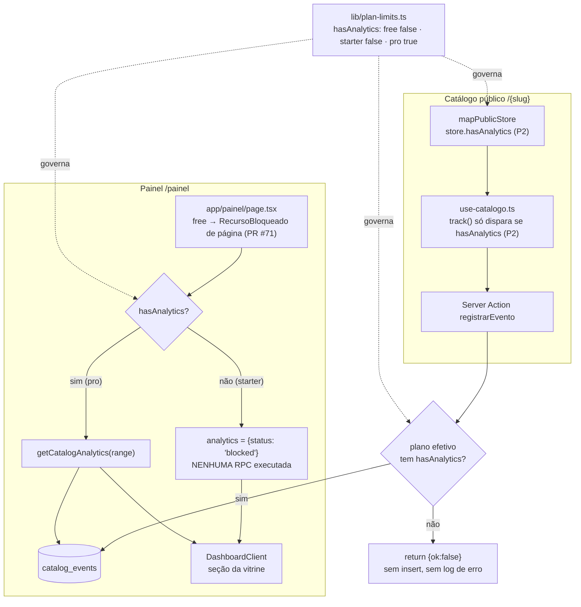

# Analytics exclusivo do plano Pro — Design

**Spec**: `.specs/features/analytics-pro-only/spec.md`
**Context**: `.specs/features/analytics-pro-only/context.md`
**Status**: Draft — aguardando aprovação

---

## Architecture Overview

Nenhuma peça nova: uma capability (`hasAnalytics`) vira a fonte única do gate e é lida nos três pontos onde o recurso se manifesta — a Server Action de captura, o server component do dashboard e (P2) o catálogo público. Zero mudança em schema, RPCs ou grants.



### Abordagens consideradas

| Abordagem | Trade-off | Veredito |
| --- | --- | --- |
| **A. Capability `hasAnalytics` lida na Server Action + no server component; estado da seção como união discriminada** | Uma regra, três leituras; reusa `getEffectivePlan`/`getPlanLimits` que já são a fonte de verdade de plano em todo o projeto; o gate da captura cabe na consulta de loja que já existe (zero round-trip novo) | **Escolhida** |
| B. Gate no banco (trigger/check em `catalog_events` recusando insert de loja não-Pro) | É o ponto mais forte contra escrita indevida, mas: a service role ignora RLS, então precisaria de trigger; a regra de plano+trial passaria a existir em SQL **e** em TS (duas fontes de verdade divergindo em silêncio); e um no-op esperado viraria erro de banco logado a cada visita de loja Free | Descartada |
| C. Gate apenas no cliente (não disparar a action fora do Pro) | Zero round-trip e mudança mínima, mas `registrarEvento` é endpoint público chamável direto — o gate seria contornável e o requisito "não gerar no Free" ficaria sem garantia | Descartada como gate único; **aproveitada como otimização P2 sobre A** |

---

## Code Reuse Analysis

### Existing Components to Leverage

| Component | Location | How to Use |
| --- | --- | --- |
| `getEffectivePlan` / `getPlanLimits` | `lib/plan-limits.ts:60` | Fonte única de plano+trial. Ganha o campo `hasAnalytics`; nenhum call site existente muda de comportamento |
| Consulta da loja por slug na captura | `app/actions/eventos.ts:30-44` | **Estender o `select` para `id, plan, trial_ends_at`** — o gate cabe aqui sem query nova (APO-06). Service role ignora RLS/grants, então ler essas colunas é livre |
| `RecursoBloqueado` | `components/painel/RecursoBloqueado.tsx` | Reuso direto no lugar da seção; ganha prop opcional para o selo |
| Gate antes do I/O no dashboard | `app/painel/page.tsx:22-29` (padrão ORD-29/ANL-18) | Mesmo formato: decidir por plano **antes** de chamar `getCatalogAnalytics` |
| `RecursoBloqueado` dentro do dashboard | `app/painel/DashboardClient.tsx:96` | Precedente exato de seção bloqueada dentro de página liberada |
| Campo derivado de limits no view-model público | `lib/catalog.ts:100` (`gridDensity`) | Mesmo padrão para `hasAnalytics` no `Store` (P2) |
| Guard `track()` no catálogo | `app/[slug]/use-catalogo.ts:31` | Já é o funil único dos 4 eventos — o curto-circuito P2 é uma linha lá dentro |

### Integration Points

| System | Integration Method |
| --- | --- |
| `catalog_events` (tabela, RPCs, grants) | **Nenhuma mudança.** Schema, `get_catalog_metrics`, `get_top_viewed_products`, grants de `service_role` e ausência de grant para `anon` ficam exatamente como estão |
| `stores.plan` / `stores.trial_ends_at` | Lidas na captura via service role (sem grant novo: service role já tem `select` na tabela). **Não** entram em `STORE_COLS` do catálogo público — o cache de `fetchRawCatalogData` proíbe plano cacheado (`lib/server/catalog.ts:24-31`); no P2 o valor vem do `get_effective_plan` que já roda fora do cache |

---

## Components

### `PlanLimits.hasAnalytics`

- **Purpose**: capability única que decide se a loja gera e vê métricas da vitrine.
- **Location**: `lib/plan-limits.ts`
- **Interfaces**: campo `hasAnalytics: boolean` — `FREE_LIMITS: false`, `STARTER_LIMITS: false`, `PRO_LIMITS: true`
- **Dependencies**: nenhuma
- **Reuses**: exatamente o formato de `hasOrderHistory` / `csvImport` / `customDomain`
- **Nota**: ressuscita ANL-20, que tinha sido supersedido quando o gate coincidia com o da página.

### `registrarEvento` (gate de captura)

- **Purpose**: recusar a gravação quando o plano efetivo não tem `hasAnalytics`.
- **Location**: `app/actions/eventos.ts` (modificar)
- **Interfaces**: assinatura inalterada — `registrarEvento(payload: unknown): Promise<RegistrarEventoResult>`
- **Ordem de execução** (APO-05 depende disso):
  1. `eventPayloadSchema.safeParse` — inalterado
  2. `select("id, plan, trial_ends_at")` da loja ativa pelo slug — **único ponto alterado da consulta**
  3. erro de banco → `console.error` + `{ok:false}` (inalterado); loja inexistente/inativa → `console.error` + `{ok:false}` (inalterado)
  4. **novo**: `getPlanLimits(store.plan, store.trial_ends_at).hasAnalytics === false` → `return { ok: false }` **sem log de erro** (APO-04)
  5. validação de posse do `product_id` — inalterada
  6. `insert` — inalterado
- **Dependencies**: `lib/plan-limits.ts`
- **Reuses**: a consulta de loja que já existia; nenhuma round-trip nova

### Estado da seção de analytics no dashboard

- **Purpose**: transportar da página para o client três situações que a UI trata de forma diferente.
- **Location**: tipo em `lib/server/analytics.ts`; produzido em `app/painel/page.tsx`; consumido em `app/painel/use-dashboard.ts` e `app/painel/DashboardClient.tsx`
- **Interfaces**:
  ```typescript
  export type AnalyticsState =
    | { status: "ok"; data: CatalogAnalytics }   // pro, leitura ok (zero real vem como zero)
    | { status: "blocked" }                      // sem hasAnalytics: NENHUMA query rodou
    | { status: "unavailable" };                 // pro, leitura falhou
  ```
- **Por que união e não uma flag a mais**: hoje `analytics: CatalogAnalytics | null` já carrega dois sentidos, e `null` significa "falhou". Passar `null` para o Starter faria o lojista ver *"Não foi possível carregar agora"* em vez do upsell — bug silencioso que nenhum teste atual pegaria. A união torna o caso impossível de escrever por engano (APO-11).
- **Import type-only**: `DashboardClient` já faz `import type { CatalogAnalytics } from "@/lib/server/analytics"` — tipo de módulo `server-only` é apagado na compilação, então declarar `AnalyticsState` ao lado mantém o padrão existente sem puxar código de servidor para o bundle.

### `app/painel/page.tsx` (gate de exibição)

- **Purpose**: não executar nenhuma leitura de analytics fora do Pro.
- **Location**: `app/painel/page.tsx` (modificar)
- **Comportamento**:
  ```typescript
  const limits = getPlanLimits(store.plan, store.trialEndsAt);   // já existe para hasOrderHistory
  let analytics: AnalyticsState = { status: "blocked" };
  if (limits.hasAnalytics) {
    try {
      analytics = { status: "ok", data: await getCatalogAnalytics(store.id, range) };
    } catch (error) {
      console.error("DashboardPage: erro ao ler métricas da vitrine —", error);
      analytics = { status: "unavailable" };
    }
  }
  ```
- **Reuses**: a chamada de `getPlanLimits` já presente na linha do `hasOrderHistory` (uma só chamada serve às duas decisões)
- **Nota**: o gate de página do Free (PR #71) continua acima disso e não é tocado — o `free` nunca chega nessa linha.

### `RecursoBloqueado` (selo variável)

- **Purpose**: exibir "Disponível no plano Pro" quando o recurso é do Pro.
- **Location**: `components/painel/RecursoBloqueado.tsx` (modificar)
- **Interfaces**: `planoMinimo?: "starter" | "pro"` — **default `"starter"`**, preservando os 3 call sites existentes sem alteração
- **Mapa de selo**: `starter → "Disponível a partir do plano Starter"` (texto atual, byte a byte) · `pro → "Disponível no plano Pro"`
- **Reuses**: todo o resto do componente (cadeado, `Card`, CTA `vtrineWhatsAppHref`) intacto

### `use-dashboard` + `DashboardClient` (seção da vitrine)

- **Purpose**: renderizar métricas, upsell ou aviso de erro conforme o estado.
- **Location**: `app/painel/use-dashboard.ts`, `app/painel/DashboardClient.tsx` (modificar)
- **Comportamento**: `catalogStats`/`topViewed` só existem em `status: "ok"`; `"blocked"` → `<RecursoBloqueado planoMinimo="pro" titulo="Sua vitrine em números" descricao="…" />`; `"unavailable"` → texto atual *"Não foi possível carregar agora."*
- **Copy sugerida do bloqueio**: *"Veja quantas pessoas visitam sua vitrine, o que mais olham e quanto disso vira pedido. Disponível no plano Pro."* — sem nenhum número real no componente (regra ORD-28)
- **Reuses**: `computeConversionPct`, `StatCard`, lista de mais vistos — toda a renderização do caso `"ok"` permanece idêntica

### (P2) `Store.hasAnalytics` + curto-circuito no catálogo

- **Purpose**: não gastar round-trip para lojas que não têm o recurso.
- **Location**: `lib/types.ts` (`Store`), `lib/catalog.ts` (`mapPublicStore`), `lib/data.ts` (mock `STORE`), `app/[slug]/use-catalogo.ts` (`track`)
- **Interfaces**: `Store.hasAnalytics: boolean` — campo **obrigatório**, derivado de `limits.hasAnalytics` dentro de `mapPublicStore`, exatamente como `gridDensity`
- **Guard**: `function track(...) { if (!store.hasAnalytics) return; … }` — um único ponto, já que os 4 eventos passam por ele
- **Por que obrigatório e não opcional**: campo opcional daria default "não rastreia" em qualquer objeto que esquecesse de preenchê-lo — falha silenciosa que o TypeScript não pegaria. Obrigatório força o mock `lib/data.ts:6` a se posicionar.

---

## Data Models

Nenhum modelo de dados novo ou alterado. `catalog_events` permanece idêntica, com as linhas já gravadas de lojas free/starter mantidas (decisão registrada). O único "modelo" novo é o `AnalyticsState` acima, que é contrato de UI, não de persistência.

---

## Error Handling Strategy

| Error Scenario | Handling | User Impact |
| --- | --- | --- |
| Loja não-Pro dispara evento | `return { ok: false }` sem log | Nenhum — navegação e checkout seguem (ANL-07 intacto) |
| Erro de banco ao buscar a loja na captura | `console.error` + `{ok:false}` (caminho atual, inalterado) | Nenhum — fire-and-forget |
| `getCatalogAnalytics` falha no Pro | `catch` → `{ status: "unavailable" }` + `console.error` | "Não foi possível carregar agora." — o resto do dashboard renderiza |
| Starter abre o dashboard | `{ status: "blocked" }`, nenhuma RPC executada | Bloco de upgrade com CTA WhatsApp |
| Free abre o dashboard | Gate de página do PR #71 (inalterado) | Página inteira bloqueada, como hoje |

---

## Risks & Concerns

| Concern | Location (file:line) | Impact | Mitigation |
| --- | --- | --- | --- |
| **Testes atuais protegem o comportamento oposto.** `registrar-evento.test.ts:12-31` afirma `expect(getPlanLimits).not.toHaveBeenCalled()` para provar ANL-09 | `__tests__/registrar-evento.test.ts:12` | A suíte vai falhar por design; há risco de alguém "consertar" apagando a asserção — exatamente a violação que a skill proíbe | Task dedicada **reescreve** esses testes para o contrato novo (recusa por plano), sem deletar cobertura: cada asserção removida é substituída por outra mais forte. O mock `getEffectivePlan: () => getEffectivePlan()` descarta argumentos e precisa repassá-los |
| **Stub de limits desatualizado no teste.** `FREE_LIMITS_STUB` tem `advancedTheme` (campo inexistente) e não tem `csvImport`/`customDomain` | `__tests__/registrar-evento.test.ts:16-25` | Um stub que não bate com `PlanLimits` pode fazer o gate novo passar por acidente (`undefined` é falsy) | O stub passa a ser o objeto real importado ou é corrigido campo a campo, com `hasAnalytics` explícito nos dois valores |
| **`analytics: null` sobrecarregado.** `null` = "leitura falhou" | `app/painel/page.tsx:47`, `app/painel/use-dashboard.ts:19` | Reaproveitar `null` para "bloqueado" mostraria erro em vez de upsell ao Starter, sem teste que pegasse | União discriminada `AnalyticsState` (componente acima) |
| **Selo hardcoded no `RecursoBloqueado`** | `components/painel/RecursoBloqueado.tsx:27` | Alterar direto quebraria os 3 call sites que dependem do texto "a partir do plano Starter" | Prop opcional com default `"starter"`; nenhum call site existente muda |
| **`Store` obrigatório quebra mocks (P2)** | `lib/data.ts:6` | Build/testes falham se o mock não for atualizado | Task do P2 inclui `lib/data.ts` na mesma mudança; o compilador é o gate |
| **Custo residual sem o P2** | `app/[slug]/use-catalogo.ts:31` | Sem o curto-circuito, toda visita de loja Free continua disparando 1–4 Server Actions que agora só chegam até a 1ª query e voltam vazias — desperdício silencioso no plano mais comum | Incluir o P2 neste ciclo (recomendado). Se derrubado, registrar como dívida com gatilho |
| **Regressão silenciosa no Pro** | `__tests__/DashboardPage.test.tsx`, `__tests__/DashboardClient.test.tsx` | Refatorar o contrato `analytics` pode enfraquecer os testes de ANL-12..16 sem ninguém notar | Testes do caso `pro` são migrados para o novo contrato mantendo as mesmas asserções de valor; contagem final da suíte ≥ 956 + novos |

---

## Tech Decisions

| Decision | Choice | Rationale |
| --- | --- | --- |
| Como a captura descobre o plano | Estender o `select` da loja para `id, plan, trial_ends_at` e aplicar `getPlanLimits` | Zero round-trip novo (APO-06); a alternativa (`rpc get_effective_plan`) somaria uma ida ao banco em algo que já consulta a mesma linha |
| Forma do gate | Capability `hasAnalytics` em `PlanLimits` | Evita `plan === "pro"` espalhado por 3 arquivos; segue `hasOrderHistory`. Ressuscita ANL-20 |
| Contrato page → client | União discriminada `AnalyticsState` | Torna "bloqueado" e "indisponível" impossíveis de confundir (APO-11) |
| Recusa por plano no log | Silenciosa | No-op esperado, não falha; logar geraria uma linha por visita de loja Free |
| Selo do `RecursoBloqueado` | Prop `planoMinimo` com default `"starter"` | Mudança aditiva; call sites existentes intocados |
| Gate no banco | Não | Duplicaria a regra de plano em SQL e TS; ver abordagem B |

> **Decisão de projeto a registrar (`.specs/STATE.md`)** — **AD-014**: *A captura de telemetria da vitrine (`registrarEvento`) grava apenas quando o plano efetivo tem `hasAnalytics` (hoje só `pro`). Supersede o trecho de **AD-011** que estabelecia captura universal "para o histórico já existir no upgrade" — esse trecho continua válido para **pedidos** (`orders`), e deixa de valer para `catalog_events`. Consequência aceita: loja que assina o Pro começa sem histórico de métricas.* AD-011 recebe `status: parcialmente supersedido por AD-014 (apenas a parte de analytics)`.
