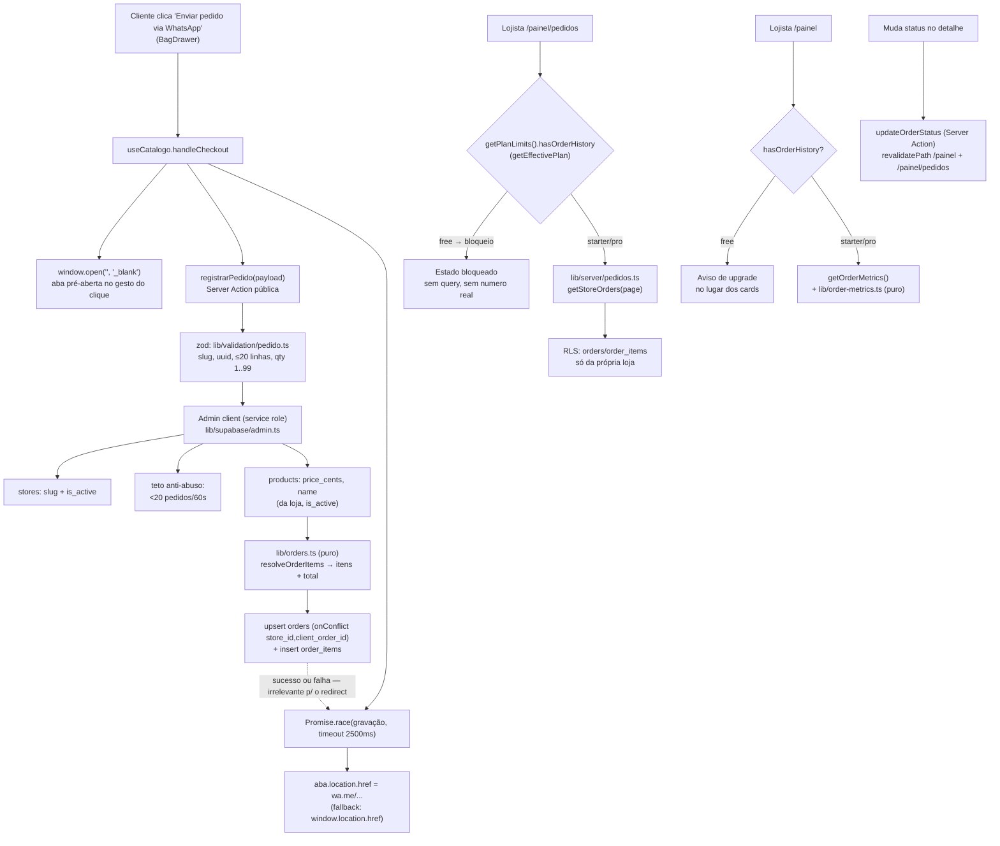

# Captura de Pedidos — Design

**Spec**: `.specs/features/captura-de-pedidos/spec.md`
**Context**: `.specs/features/captura-de-pedidos/context.md`
**Status**: Draft

---

## Architecture Overview

O checkout deixa de ser "monta mensagem → abre `wa.me`" e passa a ser "monta mensagem → **pré-abre a aba** → tenta gravar (≤2500 ms) → aponta a aba para `wa.me`". A gravação roda numa Server Action pública que **não confia em nada** do cliente: recebe slug, `client_order_id`, itens (id + variação + qtd) e o nome opcional; resolve os produtos no banco, recalcula preços e total, e grava com a **service role** (server-only). Nenhum caminho de erro da gravação bloqueia o redirect.

No painel, duas leituras novas (histórico paginado e métricas do mês) usam o client autenticado normal, protegidas por RLS por dono da loja — e **atrás de um gate de plano**: `getPlanLimits(...).hasOrderHistory` decide se a página busca dados ou renderiza o estado bloqueado. A captura, ao contrário, é indiferente ao plano: grava sempre, para que o upgrade encontre o histórico pronto.



### Approach exploration (decisão do caminho de escrita)

| # | Abordagem | Prós | Contras | Veredito |
|---|---|---|---|---|
| **A** | **Server Action pública + service role server-only** (recomendada, escolhida pelo usuário) | `orders` totalmente fechada para `anon`; toda validação e todo cálculo de preço no servidor; nada de segredo no bundle | Exige `SUPABASE_SERVICE_ROLE_KEY` em `.env.local` e na Vercel | **Escolhida** |
| B | Policy de `INSERT` para `anon` + anon key | Zero configuração nova | Qualquer um chama a API do Supabase direto e injeta pedido falso com total arbitrário → histórico e faturamento poluídos | Rejeitada (usuário) |
| C | Route Handler `POST /api/pedidos` + `navigator.sendBeacon` | Sobrevive ao unload da página no mobile | `sendBeacon` não dá resposta nem permite retry; contraria a convenção "mutação = Server Action"; ganho nulo porque a aba pré-aberta já evita o unload | Rejeitada |

Fora isso, a única alternativa relevante era o "fire-and-forget" (abrir o WhatsApp antes de gravar) — descartada pelo usuário porque a navegação para o app no mobile pode abortar a requisição.

---

## Code Reuse Analysis

### Existing Components to Leverage

| Component | Location | How to Use |
|---|---|---|
| `BagDrawer` | `components/catalogo/BagDrawer.tsx` | Estender com o campo "Seu nome (opcional)"; contrato de props ganha `customerName` + `onCustomerNameChange` |
| `useCatalogo` | `app/[slug]/use-catalogo.ts` | `handleCheckout` passa a pré-abrir a aba, chamar `registrarPedido` e só então navegar; ganha `customerName` e `clientOrderId` |
| Padrão de Server Action | `app/actions/produtos.ts` | Mesmo formato (`getCurrentStore`, `{ error }`, `revalidatePath`) para `updateOrderStatus` |
| `createClient` / `createAnonClient` | `lib/supabase/server.ts` | Novo `createAdminClient()` segue o mesmo estilo, em arquivo próprio com `import "server-only"` |
| `Pagination` + `lib/pagination.ts` | `components/ui/Pagination.tsx` | Paginação da lista de pedidos (20/página) via `?page=` |
| `Modal` | `components/ui/Modal.tsx` | Detalhe do pedido + ações de status |
| `StatCard` | `components/ui/StatCard.tsx` | Três cards de ROI no dashboard |
| `Card`, `Toast`, `Button`, `Badge` | `components/ui/` | Lista, feedback e badges de status |
| `formatCents`, `PAYMENT_METHODS`, `DELIVERY_METHODS` | `lib/utils.ts`, `lib/data.ts` | Formatação de dinheiro e labels de pagamento/entrega (lista/detalhe e validação) |
| `formatPaymentLine`/`formatDeliveryLine` | `lib/utils.ts` | Fonte dos valores válidos na validação zod (`.value` de cada lista) |
| `Sidebar` / `MobileTabBar` | `components/painel/` | Novo item "Pedidos" |
| `getCurrentStore` | `lib/server/store.ts` | Escopo da loja nas leituras e no update de status |
| Padrão de página do painel | `app/painel/produtos/page.tsx` + `use-produtos.ts` | `page.tsx` sem lógica + client + hook co-locado + `loading.tsx` |

### Integration Points

| System | Integration Method |
|---|---|
| Catálogo público (`/{slug}`) | `useCatalogo.handleCheckout` chama a Server Action antes de navegar; nenhum cache invalidado (pedido não afeta a vitrine) |
| Painel (`/painel`, `/painel/pedidos`) | Server Components dinâmicos (cookies) → leitura sempre fresca; `revalidatePath` após mudar status |
| Supabase | Duas tabelas novas (`orders`, `order_items`) com RLS `to authenticated` por dono; escrita só pela service role |
| `middleware.ts` | `/painel/pedidos` já é coberto pelo matcher de `/painel` — nenhuma mudança necessária |

---

## Components

### `orders` / `order_items` (migration)

- **Purpose**: persistir o pedido e seus itens com snapshot de nome e preço.
- **Location**: `supabase/migrations/20260727000000_orders.sql`
- **Interfaces**: DDL + RLS + grants (ver Data Models).
- **Dependencies**: `stores`, `products`.
- **Reuses**: padrão de RLS "own store only" **já corrigido** com `to authenticated` (lição da migration `20260713230000`), `on delete cascade` a partir de `stores`.

### `createAdminClient()`

- **Purpose**: client Supabase com service role, exclusivamente server-side, para gravar pedidos.
- **Location**: `lib/supabase/admin.ts`
- **Interfaces**: `createAdminClient(): SupabaseClient` — lança erro claro se `SUPABASE_SERVICE_ROLE_KEY` não estiver definida.
- **Dependencies**: `@supabase/supabase-js`, env `SUPABASE_SERVICE_ROLE_KEY` (sem `NEXT_PUBLIC_`).
- **Reuses**: mesmo formato de `createAnonClient` em `lib/supabase/server.ts`; `import "server-only"` garante erro de build se algum componente client importar por engano.

### `lib/orders.ts` (puro)

- **Purpose**: regras de pedido testáveis sem banco.
- **Location**: `lib/orders.ts`
- **Interfaces**:
  - `ORDER_STATUSES = ["pendente", "confirmado", "cancelado"] as const` / `type OrderStatus`
  - `isOrderStatus(value: unknown): value is OrderStatus`
  - `MAX_ORDER_LINES = 20`, `MAX_QTY = 99`, `CUSTOMER_NAME_MAX = 60`
  - `sanitizeCustomerName(raw: string | null | undefined): string | null` — trim, corta em 60, vazio → `null`
  - `resolveOrderItems(requested: RequestedItem[], products: ProductPriceRow[]): { items: ResolvedItem[]; totalCents: number; itemsCount: number }` — descarta item sem produto correspondente; preço sempre do `ProductPriceRow`
  - `newClientOrderId(): string` — `crypto.randomUUID()` com fallback v4 manual
- **Dependencies**: nenhuma.
- **Reuses**: nada — módulo novo, no estilo de `lib/catalog.ts` (decisão pura, sem I/O).

### `lib/validation/pedido.ts`

- **Purpose**: schema zod do payload público de captura.
- **Location**: `lib/validation/pedido.ts`
- **Interfaces**: `orderPayloadSchema` → `{ slug, clientOrderId (uuid), customerName?, payment?, delivery?, address?, items: [{ productId (uuid), size|null, color|null, qty 1..99 }] (1..20) }`; `type OrderPayload = z.infer<...>`
- **Dependencies**: zod v4, `PAYMENT_METHODS`/`DELIVERY_METHODS` (enum de valores aceitos).
- **Reuses**: mesmo estilo de `lib/validation/painel.ts`.

### `app/actions/pedidos.ts`

- **Purpose**: gravar o pedido (público) e mudar o status (painel).
- **Location**: `app/actions/pedidos.ts`
- **Interfaces**:
  - `registrarPedido(payload: unknown): Promise<{ ok: true } | { ok: false }>` — nunca lança; erros vão para `console.error`
  - `updateOrderStatus(prev: OrderStatusState, formData: FormData): Promise<OrderStatusState>` — `{ error: string } | { ok: true } | null`
- **Dependencies**: `createAdminClient`, `createClient`, `getCurrentStore`, `orderPayloadSchema`, `lib/orders.ts`.
- **Reuses**: padrão de Server Action de `produtos.ts`; `revalidatePath("/painel")` + `revalidatePath("/painel/pedidos")` no update.
- **Fluxo de `registrarPedido`**: valida → busca `stores` (id, is_active) por slug → conta pedidos dos últimos 60 s (teto 20) → busca `products` (`id, name, price_cents`) por `in (ids)` + `store_id` + `is_active` → `resolveOrderItems` → sem itens? aborta → `upsert orders … { onConflict: "store_id,client_order_id", ignoreDuplicates: true }` → duplicado (0 linhas)? retorna `{ ok: true }` → `insert order_items` → se falhar, deleta o pedido órfão (compensação) e loga.

### `lib/server/pedidos.ts`

- **Purpose**: leituras do painel.
- **Location**: `lib/server/pedidos.ts`
- **Interfaces**:
  - `getStoreOrders(storeId: string, page: number): Promise<{ orders: StoreOrder[]; total: number; page: number; totalPages: number }>`
  - `getOrderMetrics(storeId: string, now?: Date): Promise<OrderMetrics>`
- **Dependencies**: `createClient` (RLS), `lib/pagination.ts`, `lib/order-metrics.ts`.
- **Reuses**: `getTotalPages`/`clampPage`; padrão de "não engolir `error` do Supabase" (`console.error` + propagar) já documentado em `docs/CONVENTIONS.md`.

### `lib/order-metrics.ts` (puro)

- **Purpose**: cálculo das métricas de ROI sem banco.
- **Location**: `lib/order-metrics.ts`
- **Interfaces**:
  - `monthStartInSaoPaulo(now: Date): Date` — dia 1, 00:00 em `America/Sao_Paulo`, retornado em UTC
  - `computeOrderMetrics(monthRows: { status: OrderStatus; total_cents: number }[], pendingTotal: number): OrderMetrics`
  - `interface OrderMetrics { ordersThisMonth: number; confirmedCentsThisMonth: number; pendingCount: number }`
- **Dependencies**: `lib/orders.ts` (tipo de status).
- **Reuses**: `formatCents` na camada de UI (o módulo devolve centavos).

### `/painel/pedidos`

- **Purpose**: histórico paginado + detalhe + mudança de status.
- **Location**: `app/painel/pedidos/page.tsx`, `PedidosClient.tsx`, `use-pedidos.ts`, `loading.tsx`
- **Interfaces**: `page.tsx` lê `searchParams.page`, chama `getCurrentStore()` + `getStoreOrders()` e passa props; `PedidosClient` renderiza lista + `Pagination` + `Modal` de detalhe; `use-pedidos.ts` guarda o pedido selecionado e o `useActionState` de `updateOrderStatus`.
- **Dependencies**: `Card`, `Modal`, `Pagination`, `Badge`, `Button`, `Toast`, `formatCents`.
- **Reuses**: estrutura de `app/painel/produtos/` (page sem lógica + client + hook + loading).

### Dashboard (extensão)

- **Purpose**: três cards de ROI.
- **Location**: `app/painel/page.tsx`, `app/painel/DashboardClient.tsx`, `app/painel/use-dashboard.ts`
- **Interfaces**: `page.tsx` passa `metrics: OrderMetrics`; `DashboardClient` renderiza uma segunda linha de `StatCard` ("Pedidos no mês", "Vendas confirmadas no mês", "Aguardando confirmação") e um link "Ver pedidos".
- **Reuses**: `StatCard`, `formatCents`.

### Gate de plano (`hasOrderHistory`)

- **Purpose**: decidir, num único lugar, se a loja tem direito a ver histórico e métricas.
- **Location**: `lib/plan-limits.ts` (estende `PlanLimits`)
- **Interfaces**: `PlanLimits.hasOrderHistory: boolean` — `false` no Free, `true` em Starter e Pro; resolvido por `getPlanLimits(plan, trialEndsAt)`, que já passa por `getEffectivePlan()`.
- **Dependencies**: nenhuma nova.
- **Reuses**: exatamente a estrutura que já entrega `maxProducts`/`maxCategories`/`maxPhotos`, incluindo o rebaixamento automático quando `trial_ends_at` vence.
- **Consumo**:
  - `app/painel/pedidos/page.tsx` — `false` → renderiza `PedidosBloqueado` e **não chama** `getStoreOrders` (nenhum dado no HTML).
  - `app/painel/page.tsx` — `false` → não chama `getOrderMetrics`; o `DashboardClient` recebe `metrics: null` e mostra o aviso de upgrade no lugar dos três cards.
  - `app/actions/pedidos.ts` — `registrarPedido` **não** consulta plano (ORD-27); `updateOrderStatus` exige `hasOrderHistory` (um Free não deveria alcançar a UI, mas a action é a fronteira real).
- **Componente do bloqueio**: `components/painel/RecursoBloqueado.tsx` — título, descrição e CTA "Falar no WhatsApp →", reaproveitando texto/estilo do banner de `app/painel/layout.tsx:31` e `VTRINE_WHATSAPP_NUMBER` de `lib/contact.ts`.

### Navegação

- **Purpose**: acesso ao histórico.
- **Location**: `components/painel/Sidebar.tsx`, `components/painel/MobileTabBar.tsx`, `lib/types.ts` (`PainelRoute`)
- **Decisão**: item "Pedidos" (ícone `Receipt`) entra depois de "Produtos", **visível em todos os planos** (é o que gera o upgrade). O `MobileTabBar` passa a ter 6 abas; para caber em 375 px, o label de "Personalização" vira "Estilo" (o item de config já usa "Config.").

---

## Data Models

### `orders`

```sql
create table public.orders (
  id               uuid primary key default gen_random_uuid(),
  store_id         uuid not null references public.stores(id) on delete cascade,
  client_order_id  uuid not null,
  customer_name    text,
  payment_method   text,
  delivery_method  text,
  delivery_address text,
  items_count      int  not null,
  total_cents      int  not null,
  status           text not null default 'pendente'
                     check (status in ('pendente', 'confirmado', 'cancelado')),
  created_at       timestamptz default now(),
  unique (store_id, client_order_id)
);

create index orders_store_created_idx on public.orders(store_id, created_at desc);
create index orders_store_status_idx  on public.orders(store_id, status);
```

### `order_items`

```sql
create table public.order_items (
  id               uuid primary key default gen_random_uuid(),
  order_id         uuid not null references public.orders(id) on delete cascade,
  product_id       uuid references public.products(id) on delete set null,
  product_name     text not null,
  unit_price_cents int  not null,
  qty              int  not null check (qty between 1 and 99),
  size             text,
  color            text,
  created_at       timestamptz default now()
);

create index order_items_order_id_idx on public.order_items(order_id);
```

### RLS e grants (ORD-24)

```sql
alter table public.orders      enable row level security;
alter table public.order_items enable row level security;

-- Leitura só do dono da loja; policies escopadas a authenticated (lição da
-- migration 20260713230000: policy sem "TO" também vale para anon e faz o
-- Postgres tentar ler stores.owner_id como anon → permission denied).
create policy "orders: own store read" on public.orders for select to authenticated
  using (exists (select 1 from public.stores s
                 where s.id = orders.store_id and s.owner_id = auth.uid()));

create policy "orders: own store status update" on public.orders for update to authenticated
  using (exists (select 1 from public.stores s
                 where s.id = orders.store_id and s.owner_id = auth.uid()))
  with check (exists (select 1 from public.stores s
                      where s.id = orders.store_id and s.owner_id = auth.uid()));

create policy "order_items: own store read" on public.order_items for select to authenticated
  using (exists (select 1 from public.orders o
                 join public.stores s on s.id = o.store_id
                 where o.id = order_items.order_id and s.owner_id = auth.uid()));

grant select on public.orders to authenticated;
grant update (status) on public.orders to authenticated;   -- lojista só muda status
grant select on public.order_items to authenticated;

-- Nenhum privilégio para anon, em nenhuma coluna (o inverso do cuidado com
-- stores/STORE_COLS: aqui o anon jamais pode ler nem escrever).
revoke all on public.orders      from anon;
revoke all on public.order_items from anon;
```

> Escrita é exclusiva da service role (que ignora RLS) — nenhum `insert` é concedido a `authenticated` ou `anon`.

### Tipos TypeScript (em `lib/types.ts`)

```typescript
export interface StoreOrderItem {
  productName: string;
  unitPriceCents: number;
  qty: number;
  size: string | null;
  color: string | null;
}

export interface StoreOrder {
  id: string;
  createdAt: string;
  customerName: string | null;
  paymentMethod: string | null;
  deliveryMethod: string | null;
  deliveryAddress: string | null;
  itemsCount: number;
  totalCents: number;
  status: OrderStatus;
  items: StoreOrderItem[];
}
```

**Relationships**: `orders.store_id → stores.id` (cascade), `order_items.order_id → orders.id` (cascade), `order_items.product_id → products.id` (`set null`, preservando o snapshot).

**Store view model**: `Store` ganha `slug: string` (preenchido por `mapPublicStore` com `row.slug`) — hoje o slug só existe disfarçado em `catalogUrl`, e a captura precisa dele explicitamente.

---

## Error Handling Strategy

| Error Scenario | Handling | User Impact |
|---|---|---|
| Payload inválido (zod) | `registrarPedido` retorna `{ ok: false }`, `console.error` com o motivo | Nenhum — WhatsApp abre normalmente |
| Slug inexistente ou loja inativa | Retorna `{ ok: false }` sem gravar | Nenhum |
| Teto de 20 pedidos/60 s atingido | Retorna `{ ok: false }`, log de aviso | Nenhum |
| Nenhum item resolvido | Retorna `{ ok: false }` sem gravar | Nenhum |
| `client_order_id` duplicado | `upsert … ignoreDuplicates` → 0 linhas → retorna `{ ok: true }` sem gravar de novo | Nenhum |
| Falha no insert dos itens | Deleta o pedido órfão + `console.error` | Nenhum |
| Gravação > 2500 ms | `Promise.race` vence pelo timeout; a aba já pré-aberta recebe a URL | Nenhum |
| `window.open` bloqueado (`null`) | Navega na aba atual (`window.location.href`) | Vai para o WhatsApp na mesma aba |
| `SUPABASE_SERVICE_ROLE_KEY` ausente | `createAdminClient` lança; `registrarPedido` captura, loga e retorna `{ ok: false }` | Nenhum — catálogo segue funcionando sem captura |
| Erro ao ler pedidos no painel | `console.error` + propaga (vira 500 com rastro) — nunca finge lista vazia | Página de erro do painel |
| Status inválido no update | `{ error: "Status inválido." }` | Toast de erro na lista |
| Loja Free acessando `/painel/pedidos` | Gate de plano antes de qualquer query → estado bloqueado | Tela de upgrade, sem nenhum dado do histórico |
| Loja Free chamando `updateOrderStatus` | Gate `hasOrderHistory` na action → `{ error }` | Nada muda (caminho inalcançável pela UI) |
| Pedido de outra loja no update | `.eq("store_id", store.id)` + RLS → 0 linhas → `{ error }` | Toast de erro |

---

## Risks & Concerns

| Concern | Location (file:line) | Impact | Mitigation |
|---|---|---|---|
| **Segurança**: endpoint de escrita público (Server Action sem auth) | `app/actions/pedidos.ts` (novo) | Spam de pedidos falsos poluindo histórico/faturamento | Nenhum campo monetário aceito do cliente; zod estrito; teto de 20 pedidos/60 s por loja; ≤20 linhas e qty ≤99; `client_order_id` único |
| **Segurança**: service role no runtime | `lib/supabase/admin.ts` (novo) | Chave vazar no bundle = acesso total ao banco | Env sem `NEXT_PUBLIC_`; `import "server-only"` no módulo; chamada só de Server Action; nada de log da chave |
| **Segurança**: policy RLS sem `TO` vale para `anon` e quebra leitura | `supabase/migrations/20260713230000_fix_rls_own_store_only_role_scope.sql:1` | Repetir o bug que deixou o catálogo público vazio | Policies novas nascem com `to authenticated`; `revoke all … from anon` explícito |
| **Fragilidade**: `handleCheckout` acumula responsabilidades | `app/[slug]/use-catalogo.ts:100` | Hook difícil de testar e de evoluir | Lógica de captura extraída para `lib/orders.ts` (puro) + função `sendOrderCapture` isolada; `handleCheckout` só orquestra |
| **Atomicidade**: insert em duas etapas (pedido, itens) | `app/actions/pedidos.ts` (novo) | Pedido sem itens se a segunda query falhar | Compensação: deleta o pedido órfão e loga; `items_count`/`total_cents` já estão no pedido, então o card de ROI nunca fica errado por isso |
| **Performance**: contagem anti-abuso por pedido | `app/actions/pedidos.ts` (novo) | +1 query por checkout | Query `count head` sobre índice `orders(store_id, created_at desc)` — custo desprezível |
| **Test gap**: `handleCheckout` hoje só é testado pelo caminho do `window.open` | `__tests__/use-catalogo.test.ts` | Regressão silenciosa no redirect | Novos testes cobrindo: grava e abre, falha e abre, timeout e abre, pop-up bloqueado |
| **UX**: `MobileTabBar` chega a 6 abas em 375 px | `components/painel/MobileTabBar.tsx:40` | Labels truncados | Label "Personalização" → "Estilo"; verificação visual em 375 px na validação |
| **Vazamento**: dado do histórico chegando ao HTML de uma loja Free | `app/painel/pedidos/page.tsx` (novo) | Recurso pago exposto antes do upgrade | Gate de plano **antes** de `getStoreOrders`/`getOrderMetrics`; nenhum componente de bloqueio recebe pedido ou métrica como prop |
| **LGPD**: passa a existir dado pessoal informado pelo cliente | `app/politica-de-privacidade/page.tsx` | Política desatualizada | ORD-26 inclui a menção ao armazenamento de nome/itens |
| **Divergência**: preço do banco pode diferir do exibido na sacola | `lib/orders.ts` (novo) | Total do painel ≠ mensagem do WhatsApp em edição concorrente | Assunção registrada na spec; banco é fonte de verdade; janela de exposição é minúscula |

---

## Tech Decisions (only non-obvious ones)

| Decision | Choice | Rationale |
|---|---|---|
| Caminho de escrita | Server Action pública + service role server-only | Fecha `orders` para `anon`; validação e preço 100% no servidor |
| Ordem gravar/redirecionar | Aba pré-aberta no clique + `Promise.race` com timeout de 2500 ms | Escapa do bloqueador de pop-up e garante que a venda nunca é bloqueada |
| Idempotência | `unique(store_id, client_order_id)` + `upsert … ignoreDuplicates` | Duplo clique e retry não duplicam; sem lock nem sequência |
| Snapshot de item | `product_name` + `unit_price_cents` na linha; `product_id` com `on delete set null` | Histórico sobrevive à exclusão/edição do produto |
| Grant de update | `grant update (status) on orders to authenticated` | Lojista não consegue alterar total/itens nem via PostgREST direto |
| Cálculo de métricas | Módulos puros (`lib/orders.ts`, `lib/order-metrics.ts`) | Cobertura por vitest sem banco, no mesmo espírito de `lib/catalog.ts` |
| Corte do mês | `monthStartInSaoPaulo` via `Intl.DateTimeFormat` com `timeZone: "America/Sao_Paulo"` | Sem dependência nova de data; corte no fuso do lojista |
| Slug no view model | `Store.slug` explícito | `catalogUrl` guardando o slug é ambíguo e frágil para a captura |
| Detalhe do pedido | `Modal` existente | Zero componente novo; mesma linguagem visual do painel |
| Gate de plano | Capability `hasOrderHistory` em `PlanLimits`, aplicada **antes da query** | Um único ponto de verdade, já com rebaixamento por `trial_ends_at`; gate antes do I/O impede vazamento de dado no HTML |
| Captura no Free | Grava sempre, sem consultar plano | Histórico pronto no momento do upgrade; menos um caminho condicional na action pública |

> **Decisões de projeto** (a registrar em `.specs/STATE.md`): AD-007 (service role server-only + `orders` sem grant para `anon`), AD-008 (captura nunca bloqueia o redirect do WhatsApp), AD-009 (preço do banco é a fonte de verdade do pedido), AD-010 (status da venda com três estados e transição livre), AD-011 (histórico/ROI só de Starter para cima, com captura em todos os planos).
